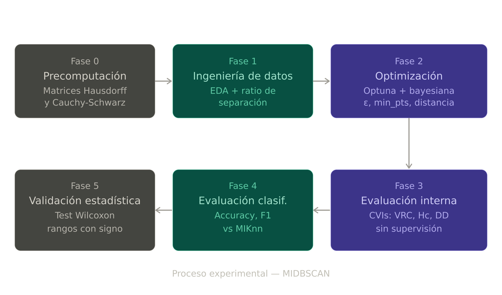

# Estudio Experimental: DBSCAN para Multi-Instance Learning

> Paquete de reproducción para el Trabajo de Fin de Grado *"Adaptación de DBSCAN al Paradigma de Aprendizaje Multinstancia (Multi-Instance Learning)"* — Universidad de Córdoba (UCO), 2026.

Este repositorio contiene todos los scripts, la configuración y las instrucciones necesarias para reproducir los resultados experimentales reportados en el TFG. Los algoritmos de agrupamiento (*clustering*) y clasificación están implementados en la librería complementaria [`miclustering`](https://github.com/Andmo2004/MIClustering), la cual se lista como dependencia y se importa aquí sin modificaciones.

---

## Tabla de contenidos

- [Descripción general](#descripción-general)
- [Estructura del repositorio](#estructura-del-repositorio)
- [Requisitos](#requisitos)
- [Instalación](#instalación)
- [Conjuntos de datos](#conjuntos-de-datos)
- [Reproducción de los experimentos](#reproducción-de-los-experimentos)
- [Resultados](#resultados)
- [Pruebas de integración](#pruebas-de-integración)
- [Cita](#cita)
- [Licencia](#licencia)

---

## Descripción general

El TFG investiga si DBSCAN, adaptado para operar directamente sobre bolsas de *Multi-Instance Learning* (MIL) mediante funciones de distancia a nivel de bolsa (*bag-level*), puede igualar el rendimiento de clasificación de los modelos de referencia (*baselines*) supervisados de MIL sin requerir información de las etiquetas durante la fase de entrenamiento.

El flujo de experimentación (*pipeline*) abarca cinco fases:

<p align="center">
  
</p>

| Fase | Script | Propósito |
|---|---|---|
| 0 | `00_precompute_matrices.py` | Almacenar en caché todas las matrices de distancia en el disco |
| 1 | `01_eda.py` | Caracterización de los conjuntos de datos y análisis de separabilidad |
| 2 | `02_hyperparameter_tuning.py` | Búsqueda basada en Optuna para (escalador, métrica, ε, min\_pts) |
| 3 | `03_clustering_quality.py` | Índices de validación interna (CVIs) evaluados sin etiquetas reales (*ground-truth*) |
| 4 | `04_comparison_vs_baseline.py` | MIDBSCAN vs MIKnn, MIKMeans, MIKMedoids en el conjunto de prueba reservado |
| 5 | `05_statistical_tests.py` | Pruebas de rangos con signo de Wilcoxon y estimación del tamaño del efecto |

El *notebook* complementario de Kaggle [`notebooks/Experiments_notebook.ipynb`](notebooks/Experiments_notebook.ipynb) ejecuta las cinco fases de principio a fin y registra la salida completa de la consola utilizada en el TFG.

---

## Estructura del repositorio

```text
tfg-experiments/
├ config/
│   └ settings.py              # Rutas a datasets, hiperparámetros óptimos, mapa de escaladores
├ data/
│   ├ datasets/                # Archivos .arff — no rastreados por git (ver Conjuntos de datos)
│   └ README.md                # Procedencia de los datasets, versiones y licencias
├ experiments/
│   ├ 00_precompute_matrices.py
│   ├ 01_eda.py
│   ├ 02_hyperparameter_tuning.py
│   ├ 03_clustering_quality.py
│   ├ 04_comparison_vs_baseline.py
│   └ 05_statistical_tests.py
├ notebooks/
│   └ Experiments_notebook.ipynb
│   └ Experiments_notebook_2.ipynb
├ optimization/
│   ├ best_params.py           # Función objetivo de Optuna y ejecución del estudio
│   ├ grid_search.py           # Wrapper de búsqueda en cuadrícula (grid search) para MIDBSCAN
│   └ knn_dist_eps.py          # Gráfico de distancias k-NN y detección del codo (knee)
├ results/                     # Salidas generadas — (*) no rastreadas por git
│   ├ distance_matrices/       # Matrices de distancia .npy en caché
├ visualization/
│   ├ boxplots.py
│   ├ heatmap.py
│   └ plotter.py
├ .gitignore
├ README.md
├ README_en.md
├ requirements.txt
└ run.py                       # Punto de entrada CLI para ejecuciones de experimentos individuales
```
> Las pruebas unitarias (unit tests) para las funciones de distancia y los algoritmos de clustering se encuentran en [`miclustering/tests/`](https://github.com/Andmo2004/MIClustering/tree/main/tests) y se mantienen junto a la librería principal.

---

## Requisitos

- Python ≥ 3.10
- La librería `miclustering` (instalada automáticamente vía `requirements.txt`)
- Los conjuntos de datos ARFF listados en `data/README.md`

---

## Instalación

### Con uv (recomendado)

```bash
# 1. Clonar este repositorio
git clone [https://github.com/Andmo2004/tfg-experiments.git](https://github.com/Andmo2004/tfg-experiments.git)
cd tfg-experiments

# 2. Crear un entorno virtual e instalar las dependencias
uv venv
source .venv/bin/activate        # macOS / Linux
.venv\Scripts\activate           # Windows

uv pip install -r requirements.txt
```

### Con pip
```bash
python -m venv .venv
source .venv/bin/activate
pip install -r requirements.txt
```

El paquete `miclustering` se instala directamente desde su repositorio de GitHub:

```
miclustering @ git+https://github.com/Andmo2004/MIClustering.git
```

No es necesario tener una copia local del código fuente de la librería.

---

## Conjuntos de datos

Los diez conjuntos de datos en formato ARFF utilizados en el TFG **no están incluidos** en este repositorio debido a restricciones de tamaño y licencias. Coloca cada archivo en la carpeta `data/datasets/` antes de ejecutar cualquier experimento.

| Dataset | Bags | Instances | Features | Source |
|---|---|---|---|---|
| Musk1 | 92 | 476 | 166 | [UCI ML Repository](https://archive.ics.uci.edu/dataset/74/musk+version+1) |
| Musk2 | 102 | 6 598 | 166 | [UCI ML Repository](https://archive.ics.uci.edu/dataset/75/musk+version+2) |
| ImageElephant | 200 | 1 391 | 230 | [Andrews et al., 2003](https://dl.acm.org/doi/10.5555/2981345.2981352) |
| BirdsChestnut | 548 | 10 232 | 38 | [Briggs et al., 2012](https://dl.acm.org/doi/10.1145/2339530.2339745) |
| BirdsHammonds | 548 | 10 232 | 38 | [Briggs et al., 2012](https://dl.acm.org/doi/10.1145/2339530.2339745) |
| Harddrive1 | 369 | 68 411 | 61 | [Krause et al., 2016](https://www.usenix.org/conference/fast16) |
| Mutagenesis (atoms) | 188 | 1 618 | 10 | [Srinivasan et al., 1996](https://link.springer.com/article/10.1007/BF00114804) |
| Mutagenesis (chains) | 188 | 5 349 | 24 | [Srinivasan et al., 1996](https://link.springer.com/article/10.1007/BF00114804) |
| Newsgroups1 | 100 | 5 443 | 200 | [Zhou et al., 2009](https://dl.acm.org/doi/10.1145/1553374.1553534) |
| Thioredoxin | 193 | 26 611 | 8 | [Gärtner et al., 2002](https://link.springer.com/chapter/10.1007/3-540-36755-1_12) |

Consulta `data/README.md` para obtener instrucciones de descarga y detalles sobre la licencia de cada conjunto de datos.

## Reproducción de los experimentos

Todas las fases asumen que los conjuntos de datos están presentes en `data/datasets/` y que el entorno virtual está activado. Ejecuta las fases en orden; cada fase lee las salidas de las anteriores desde la carpeta `results/`.

**Fase 0 — Precalcular matrices de distancia** *(ejecutar una vez; ~>1 h en la primera ejecución)*

```bash
python experiments/00_precompute_matrices.py
```

Calcula y almacena en caché todas las matrices de distancia (dataset × escalador × métrica) en `results/distance_matrices/`. Las fases posteriores las cargarán desde la caché, evitando recalcularlas.

**Fase 1 — Análisis exploratorio de datos (EDA)**

```bash
python experiments/01_eda.py
```

Genera ratios de separabilidad, diagramas de caja del recuento de instancias y mapas de calor (heatmaps) de distancias en `results/figures/`, así como un CSV resumen en `results/tables/eda_summary.csv`.

**Fase 2 — Ajuste de hiperparámetros**

```bash
python experiments/02_hyperparameter_tuning.py
```

Evalúa los índices SED, DD, Hc, VRC e I para la configuración óptima de cada conjunto de datos y dos perturbaciones de ε (×0.5 y ×2.0). Genera el archivo `results/tables/optuna_best_params_<timestamp>.csv`. Este archivo es detectado automáticamente por `config/settings.py` en la siguiente ejecución.

**Fase 3 — Calidad interna del agrupamiento (Clustering)**

```bash
python experiments/03_clustering_quality.py
```

Evalúa los índices SED, DD, Hc, VRC e I para la configuración óptima de cada conjunto de datos y dos perturbaciones de ε (×0.5 y ×2.0). Genera el archivo `results/tables/cvi_comparative_<timestamp>.csv` y la correlación de Spearman entre VRC/I y F1.

**Fase 4 — Comparación frente a los modelos de referencia (baselines)**

```bash
python experiments/04_comparison_vs_baseline.py
```

Entrena MIDBSCAN, MIKMeans, MIKMedoids y MIKnn (mejor k vía validación interna) en una partición estratificada 70/30, y evalúa todos los modelos en el conjunto de prueba reservado. Genera `results/tables/full_eval_<timestamp>.csv` y figuras de las matrices de confusión para los conjuntos de datos más representativos.

**Fase 5 — Validación estadística**

```bash
python experiments/05_statistical_tests.py
```

Lee el último `full_eval_*.csv` y ejecuta pruebas de rangos con signo de Wilcoxon (α = 0.05) con estimación del tamaño del efecto (r = Z / √N) tanto para comparaciones globales como por subgrupos.

### Ejecutar todas las fases a la vez (Kaggle / CI)

```bash
for phase in 00 01 02 03 04 05; do
    python experiments/${phase}_*.py
done
```

El notebook de Kaggle replica esta secuencia y archiva la salida de consola completa como parte del registro de entrega.

---

## Resultados

Resultados clave del TFG (partición 70/30, semilla 42, algoritmo húngaro para asignación de etiquetas):

| Dataset | MIDBSCAN F1 | MIKnn F1 | Δ F1 |
|---|---|---|---|
| Musk1 | 0.788 | 0.849 | −0.061 |
| Musk2 | 0.640 | 0.828 | −0.188 |
| ImageElephant | 0.729 | 0.773 | −0.044 |
| BirdsChestnut | 0.678 | 0.686 | −0.008 |
| BirdsHammonds | 0.984 | 0.984 | +0.000 |
| Harddrive1 | 0.983 | 0.957 | +0.026 |
| Mutagenesis (atoms) | 0.881 | 0.872 | +0.009 |
| Mutagenesis (chains) | 0.800 | 0.868 | −0.068 |
| Newsgroups1 | 0.786 | 0.417 | +0.369 |
| Thioredoxin | 0.182 | 0.316 | −0.134 |

Prueba de rangos con signo de Wilcoxon (F1 global): W = 14.0, p = 0.359, r = 0.29. La hipótesis nula de igual rendimiento entre MIDBSCAN y MIKnn no se rechaza con un nivel de significancia α = 0.05.

Las tablas completas, las figuras y las matrices de confusión por conjunto de datos están disponibles en la carpeta

---

## Cita

Si utilizas este código o la configuración experimental en tu propio trabajo, por favor cítalo de la siguiente manera:

```bibtex
@bachelorsthesis{mors2026midbscan,
  author  = {Moros Rincón, Andrés},
  title   = {Adapting {DBSCAN} to the Multi-Instance Learning Paradigm},
  school  = {Universidad de Córdoba / University of Cordoba},
  year    = {2026},
  type    = {Bachelor's Thesis},
}
```